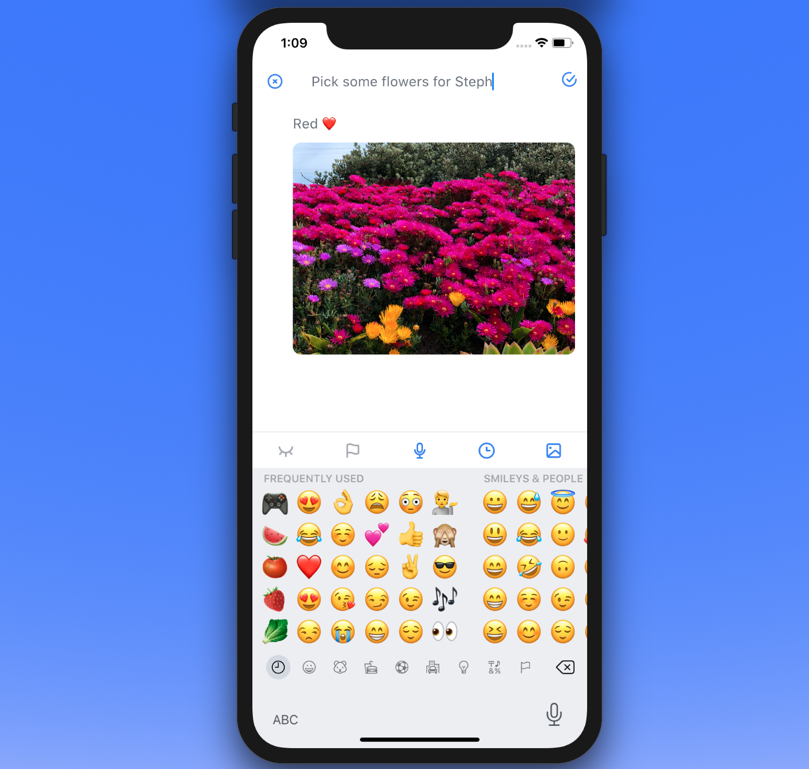

<h1 align="center">NOT3s</h1>


## Installation

This repo consits of the source code to run Not3s locally.
So this guide assumes you have the [Flutter SDK](https://flutter.dev/docs/get-started/install) installed.


- Clone this repository:

```console
$ git clone https://github.com/adeolaex/Not3s.git
Cloning into 'Not3s'...
remote: Enumerating objects: 549, done.
remote: Counting objects: 100% (549/549), done.
remote: Compressing objects: 100% (364/364), done.
remote: Total 549 (delta 277), reused 395 (delta 145), pack-reused 0
Receiving objects: 100% (549/549), 5.48 MiB | 7.92 MiB/s, done.
Resolving deltas: 100% (277/277), done.
```
- Move into the cloned repo:

```console
$ cd Not3s/lib
```

- To run in debug mode:

```console
$ flutter run --debug
```

- To run in release mode:

```console
$ flutter run --release
```

---

## Features

* A set of usefull tools to help store notes, audio and video files.
* It is Cross-Platform. Roughly 93% of the codebase is shared across IOS and Android.


It uses the [SharedPreferences](https://pub.dev/packages/shared_preferences) package to store the notes locally and the [flutter_local_notifications](https://pub.dev/packages/flutter_local_notifications) to send out local notifications. A backend will be added soon in order to have cloud functionality.


---

## Upcoming Fixes

* Audio storage.
* Cloud Syncing and Authentication.
* Planning on using the SKSL shader warmup on ios for a better faster perfoamce. See [this](https://github.com/flutter/flutter/issues/61450) for more info.


---




[website]: https://github.com/flutter/flutter/issues/61045
